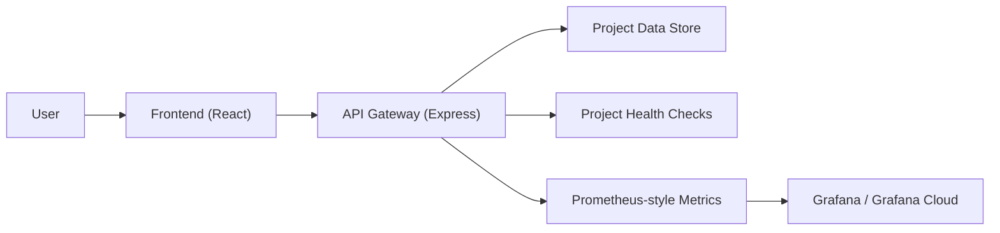

# DevPilot AI

DevPilot AI is a project-centric SaaS demo for engineering teams. It combines project management, task tracking, deployment history, incident tracking, and Grafana-backed monitoring in one workflow.

Core flow:

`Login -> Overview -> Projects -> Project Detail -> Tasks / Kanban / Deployments / Incidents / Monitoring`

## What It Does

- Create and manage projects
- Track tasks in list and Kanban views
- Record deployments from manual input or webhooks
- Track incidents per project
- Monitor project app health from a public app URL
- Open project-specific Grafana dashboards

## Stack

- Frontend: React + TypeScript + Vite
- Backend: Express + TypeScript
- Data: Postgres in production, local store for development
- Observability: Prometheus metrics + Grafana / Grafana Cloud
- Hosting: Vercel

## Architecture



## Repo Layout

```text
apps/
  api-gateway/    Express API and metrics publisher
  frontend/       React app
packages/
  config/
  logger/
  shared-types/
  shared-utils/
monitoring/
  grafana/
  prometheus/
docs/
  api/
  architecture/
  grafana-cloud.md
```

## Main Routes

- `/login`
- `/`
- `/projects`
- `/projects/:id`

Everything important happens inside a project.

## Local Development

Install dependencies:

```bash
npm --prefix apps/api-gateway install
npm --prefix apps/frontend install
```

Seed local demo data:

```bash
npm run seed
```

Run the API:

```bash
npm run dev:api
```

Run the frontend:

```bash
npm run dev
```

Open:

- Frontend: `http://localhost:5173`
- API: `http://localhost:3000`
- Metrics: `http://localhost:3000/metrics`

## Docker

Run the local platform:

```bash
docker compose up --build
```

Services:

- Frontend: `http://localhost:5173`
- API: `http://localhost:3000`
- Prometheus: `http://localhost:9090`
- Grafana: `http://localhost:3001`

Grafana local login:

- user: `admin`
- password: `admin`

## Monitoring Model

When a project has an `appUrl`, DevPilot checks it periodically and records:

- health state
- HTTP status code
- response time
- uptime trend

The API exposes Prometheus-style metrics such as:

- `http_requests_total`
- `http_request_duration_seconds`
- `projects_created_total`
- `tasks_created_total`
- `deployments_created_total`
- `incidents_created_total`
- `active_projects_total`
- `project_health_status`
- `project_response_time_ms`
- `project_http_status_code`
- `project_uptime_percent`

In production, DevPilot can also push these project metrics to Grafana Cloud directly from the API gateway.

## Deployment Tracking

Projects support deployment webhooks and manual deployment entries.

Webhook endpoint shape:

```text
/webhooks/deployments/:platform/:token
```

Supported platforms:

- GitHub Pages
- Vercel
- Railway
- Render
- Other

## Troubleshooting

- API not starting: make sure port `3000` is free
- Frontend not loading data: verify the API is reachable at `http://localhost:3000`
- Grafana says dashboard not found: import [project-observability.json](/Users/abhinavanand/Documents/Codex/2026-06-11/files-mentioned-by-the-user-devpilot/DEVPILOT-AI-1/monitoring/grafana/dashboards/project-observability.json) and keep the UID `devpilot-project-observability`
- Grafana Cloud opens but shows no data: confirm a project has an `appUrl` and that DevPilot has pushed metrics through activity or cron

## Build

```bash
npm run build
```

## Useful Docs

- API docs: [docs/api/README.md](/Users/abhinavanand/Documents/Codex/2026-06-11/files-mentioned-by-the-user-devpilot/DEVPILOT-AI-1/docs/api/README.md)
- Architecture overview: [docs/architecture/overview.md](/Users/abhinavanand/Documents/Codex/2026-06-11/files-mentioned-by-the-user-devpilot/DEVPILOT-AI-1/docs/architecture/overview.md)
- Grafana Cloud setup: [docs/grafana-cloud.md](/Users/abhinavanand/Documents/Codex/2026-06-11/files-mentioned-by-the-user-devpilot/DEVPILOT-AI-1/docs/grafana-cloud.md)
