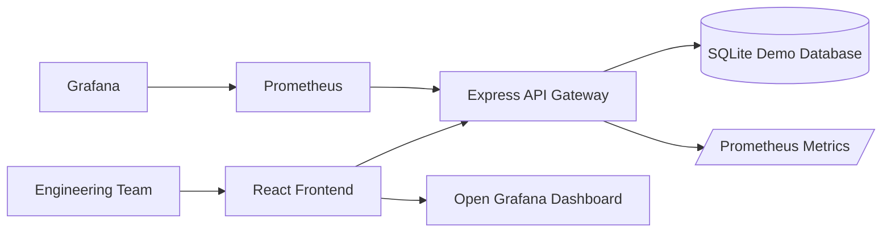

# DevPilot AI

DevPilot AI is a TypeScript internship demo for project management, deployment tracking, and monitoring.

The app is intentionally project-centric:

Login -> Overview -> Projects -> Project Detail -> Tasks/Kanban/Deployments/Incidents/Monitoring -> Grafana

## Authentication

Authentication is localStorage-based for demo use. Register an account on `/login`, then log in with that email and password. No backend auth service is required.

## Architecture



## Folder Structure

```text
apps/
  frontend/       React + Vite application
  api-gateway/    Express + SQLite API
services/
  auth-service/
  project-service/
  analytics-service/
  notification-service/
packages/
  shared-types/
  shared-utils/
  config/
  logger/
monitoring/
  prometheus/
  grafana/
docs/
```

The frontend contains only the primary product routes:

- `/login`
- `/`
- `/projects`
- `/projects/:id`

Tasks, Kanban, deployments, incidents, and monitoring are accessed inside `/projects/:id`.

## Local Development

Install dependencies in the two runnable apps:

```bash
npm --prefix apps/api-gateway install
npm --prefix apps/frontend install
```

Clear local data:

```bash
npm run seed
```

Start the API:

```bash
npm run dev:api
```

Start the frontend:

```bash
npm run dev
```

Open:

- Frontend: `http://localhost:5173`
- API Gateway: `http://localhost:3000`
- Metrics: `http://localhost:3000/metrics`

## Troubleshooting

- API not starting: check port `3000` is free.
- Frontend cannot load data: verify the API is running and reachable at `http://localhost:3000`.
- Grafana link opens but cannot find the dashboard: import [project-observability.json](/Users/abhinavanand/Documents/Codex/2026-06-11/files-mentioned-by-the-user-devpilot/DEVPILOT-AI-1/monitoring/grafana/dashboards/project-observability.json) into Grafana and keep the UID `devpilot-project-observability`.
- Grafana Cloud link opens but shows no metrics: confirm the Vercel API cron or project activity has pushed metrics successfully.

## Docker

Run the complete platform:

```bash
docker compose up --build
```

Services:

- Frontend: `http://localhost:5173`
- API Gateway: `http://localhost:3000`
- Prometheus: `http://localhost:9090`
- Grafana: `http://localhost:3001`

Grafana login:

- User: `admin`
- Password: `admin`

Anonymous dashboard viewing is also enabled for demo use, so if Grafana is exposed publicly the project dashboard link can open without a separate login.

## Monitoring

Prometheus scrapes the API gateway `/metrics` endpoint.

Tracked application metrics:

- `http_requests_total`
- `http_request_duration_seconds`
- `projects_created_total`
- `tasks_created_total`
- `deployments_created_total`
- `incidents_created_total`
- `active_projects_total`

Grafana is provisioned automatically from `monitoring/grafana`.

The React monitoring page intentionally does not recreate Grafana charts. It shows service health and links to Grafana for detailed observability.

Project monitoring flow:

```text
Project app URL -> DevPilot health checker -> /metrics -> Prometheus -> Grafana
```

When a project has an App URL, DevPilot checks it every 30 seconds and records HTTP status code, response time, health status, and uptime history. These are exposed as Prometheus metrics:

- `project_health_status`
- `project_response_time_ms`
- `project_http_status_code`
- `project_uptime_percent`
- `project_health_checks_count`

The project Monitoring tab links to the provisioned Grafana dashboard `Project Observability`.

For deployed frontend environments such as Vercel, set a public Grafana URL with:

```bash
VITE_OPEN_GRAFANA_URL=https://your-public-grafana-url
```

Without that variable, the UI correctly shows `Grafana unavailable` instead of sending users to `localhost`.

To use Grafana Cloud as the global monitoring destination, see [docs/grafana-cloud.md](/Users/abhinavanand/Documents/Codex/2026-06-11/files-mentioned-by-the-user-devpilot/DEVPILOT-AI-1/docs/grafana-cloud.md). DevPilot is set up to forward Prometheus metrics to Grafana Cloud through Prometheus `remote_write`.

On Vercel, DevPilot can also push project metrics directly to Grafana Cloud from the API gateway. A production cron job is configured at `/api/cron/push-metrics`. On Hobby plans, Vercel cron jobs run once per day.

If the Grafana button refuses to connect, start the monitoring stack:

```bash
docker compose up --build prometheus grafana api-gateway
```

Grafana runs at `http://localhost:3001`.

## Deployment Tracking

Each project has a Deployments tab for release records from manual entries or CI/CD tools.

CI/CD systems can post deployment events to:

```text
POST /api/projects/:projectId/deployments/webhook
```

Example payload:

```json
{
  "provider": "GitHub Actions",
  "service": "payment-service",
  "version": "v1.4.2",
  "environment": "production",
  "status": "succeeded",
  "deploymentUrl": "https://github.com/acme/app/actions/runs/123",
  "commitSha": "abc123def456",
  "branch": "main",
  "triggeredBy": "release-bot",
  "externalId": "123"
}
```

Supported providers are `Vercel`, `GitHub Actions`, `Railway`, `Render`, `Manual`, and `Other`. Deployment records are project-scoped release history; detailed latency and request metrics stay in Grafana.

## Build

```bash
npm run build
```

## Project Docs

- Architecture overview: [docs/architecture/overview.md](/Users/abhinavanand/Documents/Codex/2026-06-11/files-mentioned-by-the-user-devpilot/DEVPILOT-AI-1/docs/architecture/overview.md)
- API docs: [docs/api/README.md](/Users/abhinavanand/Documents/Codex/2026-06-11/files-mentioned-by-the-user-devpilot/DEVPILOT-AI-1/docs/api/README.md)
- Grafana Cloud setup: [docs/grafana-cloud.md](/Users/abhinavanand/Documents/Codex/2026-06-11/files-mentioned-by-the-user-devpilot/DEVPILOT-AI-1/docs/grafana-cloud.md)
